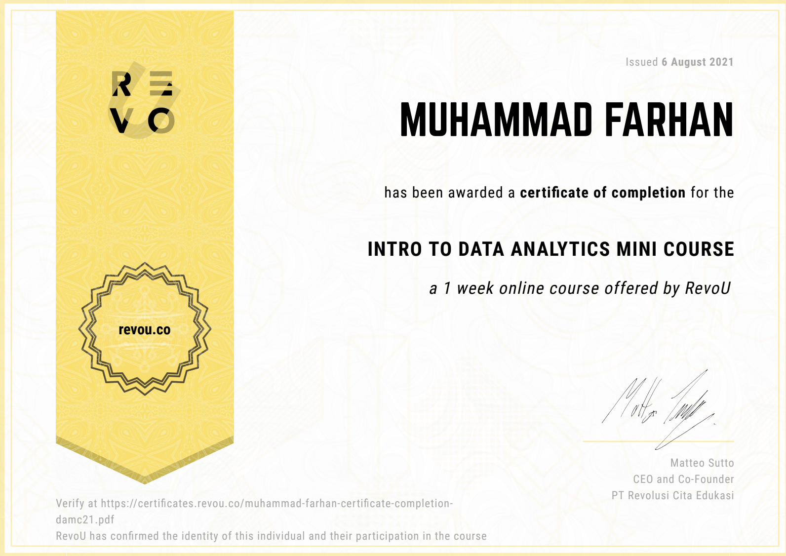

  

 

<h1 align="center">Revou Data Analytics</h1>

  Repositori ini berisi tentang hasil pembelajaran saya selama mengikuti <strong>Mini Course Data Analytic</strong> dari <strong>Revou</strong>.

  Source Data :

<a> <strong>Revou</strong> </a>

  Editor :

  
  

  Languages :

  

Certificate of Completion

 

  

 
